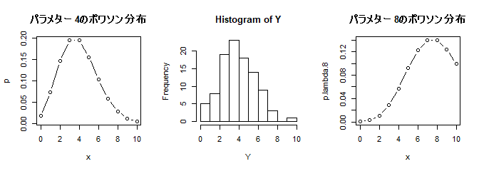
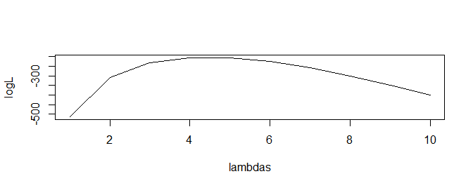

Generalized Linear Model
================
Takeshi Kishiyama
2019/06/14 16:33

はじめに
========

GLM
---

一般化線形モデル、GLM(Generalized Linear Model)とは？ <br> (教科書のp.141)

-   説明変数 (*x*<sub>*i*1</sub>, *x*<sub>*i*2</sub>, ..., *x*<sub>*i**k*</sub>) と 切片 *β*<sub>0</sub> 、傾き (*β*<sub>1</sub>, *β*<sub>2</sub>, ...*β*<sub>*k*</sub>) で 応答変数 *y*<sub>*i*</sub> をモデルする。
-   *f*(*y*<sub>*i*</sub>)=*z*<sub>*i*</sub> = *β*<sub>0</sub> + *β*<sub>1</sub>*x*<sub>*i*1</sub> + *β*<sub>2</sub>*x*<sub>*i*2</sub> + ...*β*<sub>*k*</sub>*x*<sub>*i**k*</sub> + *ϵ*
-   左辺はリンク関数 *f*(*y*<sub>*i*</sub>) で 右辺の *z*<sub>*i*</sub> を線形予測子と呼ぶ。
-   なお、*f*(*y*) の *y* は応答変数 *y* が従う確率分布のパラメターとする。

なるほど（わからん）

GLM
---

とりあえず、わからないものたちを列挙

-   *f*(*y*<sub>*i*</sub>)=*z*<sub>*i*</sub> = *β*<sub>0</sub> + *β*<sub>1</sub>*x*<sub>*i*1</sub> + *β*<sub>2</sub>*x*<sub>*i*2</sub> + ...*β*<sub>*k*</sub>*x*<sub>*i**k*</sub> + *ϵ*
    -   *y*<sub>*i*</sub> とか *x*<sub>*i*</sub> とかわからん。
    -   切片 *β*<sub>0</sub> 、傾き (*β*<sub>1</sub>, *β*<sub>2</sub>, ...*β*<sub>*k*</sub>) ってなに？
    -   モデルするってどういう意味？
-   左辺はリンク関数 *f*(*y*<sub>*i*</sub>) で 右辺の *z*<sub>*i*</sub> を線形予測子と呼ぶ。
    -   関数わからん。読み終わった後に「で、リンク関数って何？」ってなる。
-   なお、*f*(*y*) の *y* は応答変数 *y* が従う確率分布のパラメターとする。
    -   で結局*y*は何なの？

GLMとは？
---------

難しい話を順序だてて整理していく<br> *f*(*y*<sub>*i*</sub>)=*z*<sub>*i*</sub> = *β*<sub>0</sub> + *β*<sub>1</sub>*x*<sub>*i*1</sub> + *β*<sub>2</sub>*x*<sub>*i*2</sub> + ...*β*<sub>*k*</sub>*x*<sub>*i**k*</sub> + *ϵ*

-   式全体(関数、*y*<sub>*i*</sub> や *x*<sub>*i*</sub> i.e. ベクトル)、推定
    -   → R入門の章で片付けます。
-   説明変数、応答変数
    -   → 8,9章で片付けます。
-   線形予測子、リンク関数
    -   10章で片付けます。

今日のテーマ
------------

以下でGLMが分かる

-   R入門
    -   関数とベクトル、関数の最適化を理解する
-   8章と9章
    -   因果(説明変数、応答変数)を理解する
-   10章
    -   線形予測子とリンク関数を理解する

R入門
=====

今日のテーマ
------------

-   **R入門**
-   8章と9章
-   10章

``` r
# 余白があるのでシードを与える
# 乱数なんかを固定できる
set.seed(1)
```

R入門
-----

-   関数と型、ベクトル
-   確率密度関数、尤度、パラメター
-   色々な最尤推定、関数の最適化

関数と型、ベクトル
------------------

確率密度関数って言ってるけど、そもそも**関数**ってなんだっけ？

-   「もらった要素（引数）に手を加えてから返すもの」です。

``` r
factorial(5)
```

    ## [1] 120

``` r
my.f <- function(x){
    x + 2
}
my.f(4)
```

    ## [1] 6

関数と型、ベクトル
------------------

なら「型」ってなんですか？

-   文字型とか数字型とか色々あります。
-   関数の引数は特定の型しか受けつない場合があります。

``` r
class("猫")
```

    ## [1] "character"

``` r
class(2)
```

    ## [1] "numeric"

``` r
# factorial("猫")
# Error in x + 1 : non-numeric argument to binary operator
```

関数と型、ベクトル
------------------

関数と型は分かったけど、「ベクトル」は？

-   全要素の型が同型と保証されています(atomic vector)。
-   その型を引数にとる関数を全要素に適用(apply)できます！

``` r
X <- 1:10
X
```

    ##  [1]  1  2  3  4  5  6  7  8  9 10

``` r
factorial(X)
```

    ##  [1]       1       2       6      24     120     720    5040   40320
    ##  [9]  362880 3628800

``` r
# sapply(X, factorial)
```

関数と型、ベクトルのまとめ
--------------------------

ここまでのまとめ

-   関数は引数をとって操作を行ない結果を返す
-   データには型があり、関数の引数には型の制限がある
-   同型である atomic vector には関数を apply できます。

えっと、じゃあ確率密度関数ってなに？

確率密度関数、パラメター、尤度
------------------------------

**確率密度関数** は任意の値をとって確率を返します...？

-   餌をばらまいたときに集まってくる猫の数
-   4匹集まる確率や10匹あつまる確率を返してくれる。

``` r
x <- 0:10  # 0から10までの atomic vector
dpois(lambda=4, 10) # 4匹集まる確率。lambda=4はとりあえず無視
```

    ## [1] 0.005292477

``` r
p <- dpois(lambda=4, x) # xに確率密度関数`dpois`をapply
p # 各値が起きる確率のベクトル
```

    ##  [1] 0.018315639 0.073262556 0.146525111 0.195366815 0.195366815
    ##  [6] 0.156293452 0.104195635 0.059540363 0.029770181 0.013231192
    ## [11] 0.005292477

確率密度関数、パラメター、尤度
------------------------------

**確率密度関数** は任意の値をとって確率を返します...？

-   餌をばらまいたときに集まってくる猫の数
-   4匹集まる確率や10匹あつまる確率を返してくれる。

``` r
plot(p~x, type="b", main="ポワソン分布(パラメターは4)")
```


確率密度関数、パラメター、尤度
------------------------------

確率密度関数を探る2つのアプローチ

-   0匹の確率、1匹の確率、とすべての条件で調べる
-   確率密度関数の **パラメター** を調べる （例: lambda=4）

``` r
layout(matrix(1:2, ncol=2))
plot(p~x, type="b", main="パラメターが4のポワソン分布")
p.lambda.8 <- dpois(lambda=8, x)  # もしパラメターが8だったら？
plot(p.lambda.8~x, type="b", main="パラメターが8のポワソン分布")
```


確率密度関数、パラメター、尤度
------------------------------

中央データはどっちのモデルから出てきたっぽい(=**尤度**)？

-   パラメターを変化させて、最も尤度の高い値を探せば当たり

``` r
Y <- rpois(100, 4.3)
layout(matrix(1:3, ncol=3)) 
plot(p~x, type="b", main="パラメター 4のポワソン分布")
hist(Y)
plot(p.lambda.8~x, type="b", main="パラメター 8のポワソン分布")
```



確率密度関数、パラメター、尤度
------------------------------

パラメターを変化させて、最も尤度の高い値を探せば当たり

-   *P*(*y*|*θ* = 4) をすべてのyで求めて掛け算...（尤度）
-   すると値が小さくなりすぎるのでY -&gt; log -&gt; sum する。（対数尤度）

``` r
# Yそれぞれの確率を求める
p <- dpois(lambda=4, Y) # atomic vector Y をdpoisにマップしている
prod(p)  # 0.1, のような値を100個掛け合わせるのでめっちゃ小さくなってしまう
```

    ## [1] 1.332031e-89

``` r
sum(log(p))  # 大小関係を見る際はlogをとってsumをとればよい。
```

    ## [1] -204.6434

確率密度関数、パラメター、尤度
------------------------------

パラメターが4の時の対数尤度は-204.6433684 。ほかの時は？

-   Yが与えられているときにパラメター(λ)の尤度を求める関数を考える

``` r
logL.f <- function(l){
    # Yは与えられていて、今度はlambda(l)を引数にとって尤度を返す
    Y.p <- dpois(lambda=l, Y)
    sum(log(Y.p))
}
# 先ほどと同じ値
logL.f(4)
```

    ## [1] -204.6434

確率密度関数、パラメター、尤度
------------------------------

-   1:10をパラメター(λ)に入れてそれぞれ求めてみる。

``` r
lambdas <- 1:10
logL <- sapply(lambdas, logL.f)
# lambda = 4 の時が一番尤度が高い <- **最尤推定値**
plot(logL~lambdas, type="l")
```


確率密度関数、パラメター、尤度
------------------------------

まとめ

-   確率密度関数は「ある値が実現する確率を返す関数」
-   「パラメター」で関数を定義してデータをモデル化
-   データに対してモデル（with パラメター）は尤度を持つ
    -   (尤度は掛け算で求められるけど、対数尤度を使う)

OK、プロットしたらわかるけど、最も尤もらしい値はどうやって求めるの？ <br>

→ 最　尤　推　定

最尤推定いろいろ
----------------

-   数式を解く(教科書pp. 152--153)
-   `optim` 関数（このチュートリアルで結構使います）

``` r
plot(logL~lambdas, type="l")
```



最尤推定いろいろ
----------------

-   数式を解く(教科書pp. 152--153)
    -   尤度関数を微分して0の値(傾きが0の部分)

``` r
plot(logL~lambdas, type="l")
```


最尤推定いろいろ
----------------

-   `optim` 関数で（このチュートリアルで結構使います）
    -   Yはすでに分かっていて、未知のlambdaを知る

``` r
# うまく行くとき、行かないときがある。（データの数に依存）
logL.f <- function(parameters){
    lambda=parameters[1]
    Y <- rpois(1000, 4.3)
    Y.p <- dpois(lambda=lambda, Y)
    - sum(log(Y.p))
}
optim(c(1), fn = logL.f)$par # パラメターの初期値を1とする(0はできなかった)
```

    ## [1] 4.3625

最尤推定いろいろ
----------------

-   `optim` 関数で（このチュートリアルで結構使います）
    -   推定する値は間接的でもよい

``` r
logL.f <- function(parameters){
    beta = parameters[1] + 2
    lambda= beta
    Y <- rpois(1000, 4.3)
    -sum(log(dpois(lambda=lambda, Y)))
}
optim(c(2), fn = logL.f)$par
```

    ## [1] 2.54375

最尤推定のまとめ
----------------

-   数学的には対数尤度関数を微分して0になった点が最尤推定地
-   `optim`関数でも実現できる
-   推定するパラメターとYの値にほかの操作が入っていてもOK

本当はMCMCなんかを使うとパラメターの確率分布、なんかも取れます。 そうすると、パラメターの値とそのばらつき、標準誤差なんかもわかります。 ただ、今回は省きます。

今日のテーマ
------------

*f*(*y*<sub>*i*</sub>)=*z*<sub>*i*</sub> = *β*<sub>0</sub> + *β*<sub>1</sub>*x*<sub>*i*1</sub> + *β*<sub>2</sub>*x*<sub>*i*2</sub> + ...*β*<sub>*k*</sub>*x*<sub>*i**k*</sub> + *ϵ*

-   **R入門** ← OK？
    -   GLMってベクトルをとる関数？ ← そうです。
    -   もしかして *β* を最適化する流れ？ ← そうです。
    -   この式の意味って？ ← こっからが本題です。
-   8章と9章
-   10章
