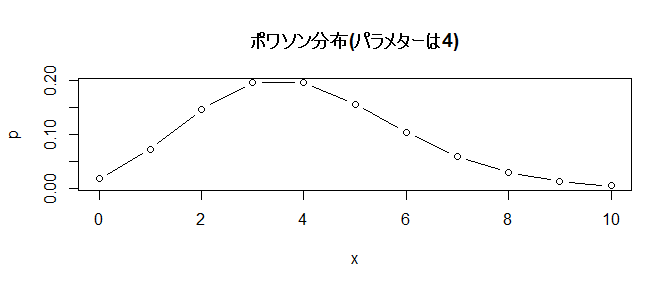
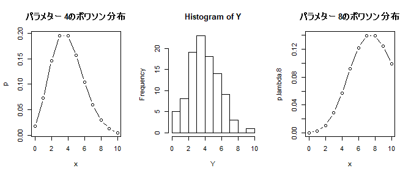
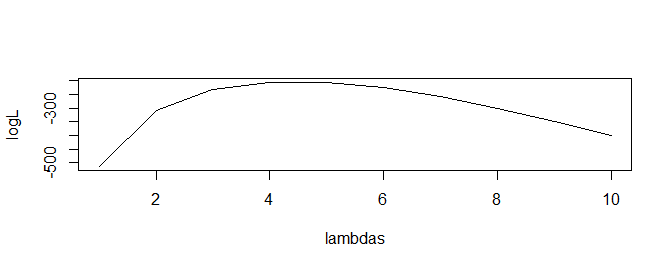

Generalized Linear Model
================
Takeshi Kishiyama
2019/06/02 10:12

R入門<br>（関数型っぽく）
=========================

今日のテーマ
------------

-   R入門（関数型っぽく）
-   8章と9章
-   10章

今日のテーマ
------------

-   **R入門（関数型っぽく）**
-   8章と9章
-   10章

``` r
set.seed(1)
```

R入門
-----

-   関数と型、ベクトル
-   確率密度関数、尤度、パラメター
-   色々な最尤推定

**関数**と型、ベクトル
----------------------

確率密度関数って言ってるけど、そもそも**関数**ってなんだっけ？

-   「もらった要素（引数）に手を加えてから返すもの」です。

``` r
factorial(5)
```

    ## [1] 120

``` r
my.f <- function(x){
    x + 2
}
my.f(4)
```

    ## [1] 6

関数と**型**、ベクトル
----------------------

なら「型」ってなんですか？

-   文字型とか数字型とか色々あります。
-   関数の引数は特定の型しか受けつない場合があります。

``` r
class("猫")
```

    ## [1] "character"

``` r
class(2)
```

    ## [1] "numeric"

``` r
# exp("猫")
# Error in exp("猫") : non-numeric argument to mathematical function
```

関数と型、**ベクトル**
----------------------

関数と型は分かったけど、「ベクトル」は？

-   全要素の型が同型と保証されています(atomic vecotr)。
-   その型を引数にとる関数を全要素に適用(apply)できます！

``` r
X <- 1:10
factorial(X)
```

    ##  [1]       1       2       6      24     120     720    5040   40320
    ##  [9]  362880 3628800

``` r
my.f(X)
```

    ##  [1]  3  4  5  6  7  8  9 10 11 12

``` r
# sapply(X, my.f)
```

関数と型、ベクトルのまとめ
--------------------------

ここまでのまとめ

-   関数は引数をとって操作を行ない結果を返す
-   データには型があり、関数の引数には型の制限がある
-   同型である atomic vecotr には関数を apply できます。

えっと、じゃあ確率密度関数ってなに？

**確率密度関数**、パラメター、尤度
----------------------------------

**確率密度関数** は任意の値をとって確率を返します...？

-   餌をばらまいたときに集まってくる猫の数
-   4匹集まる確率や10匹あつまる確率を返してくれる。

``` r
x <- 0:10  # 0から10までの値のベクトル
p <- dpois(lambda=4, x)  # 「それぞれが起こりうる確率」のベクトル
plot(p~x, type="b", main="ポワソン分布(パラメターは4)")
```



確率密度関数、**パラメター**、尤度
----------------------------------

確率密度関数を探る2つのアプローチ

-   0匹の確率、1匹の確率、とすべての条件で調べる
-   **確率密度関数のパラメターを調べる** （例: lambda=4のモデル）

``` r
layout(matrix(1:2, ncol=2))
plot(p~x, type="b", main="パラメターが4のポワソン分布")
p.lambda.8 <- dpois(lambda=8, x)  # もしパラメターが8だったら？
plot(p.lambda.8~x, type="b", main="パラメターが8のポワソン分布")
```


確率密度関数、パラメター、**尤度**
----------------------------------

-   中央データはどっちのモデルから出てきたっぽい？
    -   「モデルからデータが得られる確率」が **尤度**

``` r
Y <- rpois(100, 4.3)
layout(matrix(1:3, ncol=3)) 
plot(p~x, type="b", main="パラメター 4のポワソン分布")
hist(Y)
plot(p.lambda.8~x, type="b", main="パラメター 8のポワソン分布")
```



確率密度関数、パラメター、**尤度**
----------------------------------

-   中央データはどっちのモデルから出てきたっぽい？
    -   「モデルからデータが得られる確率」が **尤度**
    -   *P*(*y*|*θ* = 4) をすべてのyで求めて掛け算...（尤度）
    -   すると値が小さくなりすぎるのでY -&gt; log -&gt; sum する。（対数尤度）

``` r
p <- dpois(lambda=4, Y)
prod(p)
```

    ## [1] 1.332031e-89

``` r
sum(log(p))
```

    ## [1] -204.6434

確率密度関数、パラメター、**尤度**
----------------------------------

パラメターが4の時の対数尤度は-204.6433684 。ほかの時は？

-   1:10をパラメター(λ)に入れてそれぞれ求めてみる。

``` r
lambdas <- 1:10
logL.f <- function(l) sum(log(dpois(lambda=l, Y)))
logL <- sapply(lambdas, logL.f)
# lambda = 4 の時が一番尤度が高い <- **最尤推定値**
plot(logL~lambdas, type="l")
```


**確率密度関数**、パラメター、尤度
----------------------------------

まとめ

-   確率密度関数は「ある値が実現する確率を返す関数」
-   それぞれの値ではなく、「パラメター」で関数を定義してモデルした
-   手もとのデータに対して、それぞれのモデル（with パラメター）は尤度を持つ
    -   (尤度は掛け算で求められるけど、対数尤度を使う)

OK、プロットしたらわかるけど、実際に最も尤もらしい値はどうやって求めるの？

最尤推定いろいろ
----------------

-   数式で(教科書pp. 152--153)
-   `optim` 関数で（このチュートリアルで結構使います）

``` r
plot(logL~lambdas, type="l")
```



最尤推定いろいろ
----------------

-   数式で(教科書pp. 152--153)
    -   尤度関数を微分して0の値(傾きが0の部分)

``` r
plot(logL~lambdas, type="l")
```


最尤推定いろいろ
----------------

-   `optim` 関数で（このチュートリアルで結構使います）
    -   Yはすでに分かっていて、未知のlambdaを知る
    -   うまく行くとき、行かないときがある。（データの数に依存）

``` r
logL.f <- function(parameters){
    lambda=parameters[1]
    Y <- rpois(1000, 4.3)
    -sum(log(dpois(lambda=lambda, Y)))
}
optim(c(3), fn = logL.f)$par
```

    ## [1] 4.420605

最尤推定いろいろ
----------------

-   `optim` 関数で（このチュートリアルで結構使います）
    -   推定する値は間接的でもよい

``` r
logL.f <- function(parameters){
    beta = parameters[1] + 2
    lambda= beta
    Y <- rpois(1000, 4.3)
    -sum(log(dpois(lambda=lambda, Y)))
}
optim(c(2), fn = logL.f)$par
```

    ## [1] 2.54375

最尤推定のまとめ
----------------

-   数学的には対数尤度関数を微分して0になった点が最尤推定地
-   `optim`関数でも実現できる
-   推定するパラメターとYの値にほかの操作が入っていてもOK

今日のテーマ
------------

-   **R入門（関数型っぽく）** ← OK？
    -   説明が足りなかった部分、教えてくださいー
-   8章と9章
-   10章
