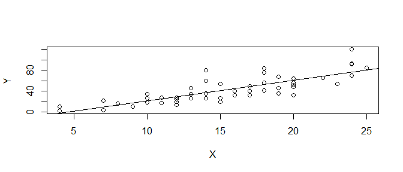
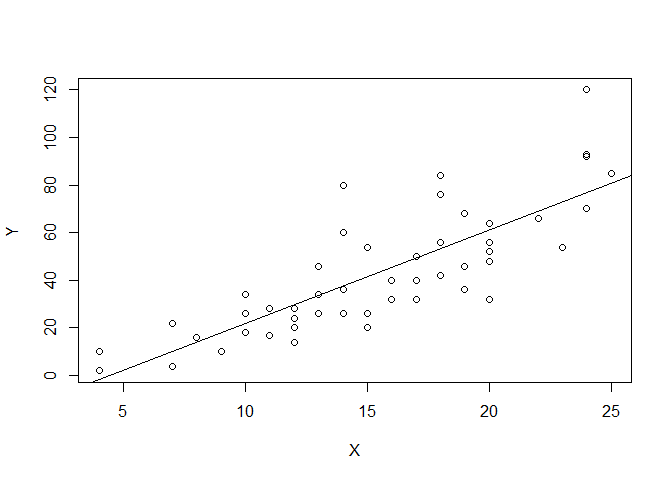
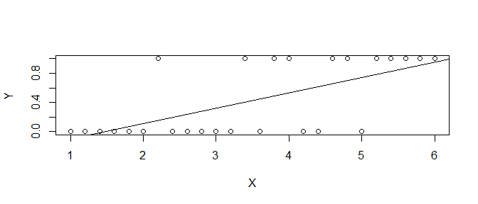

Generalized Linear Model
================
Takeshi Kishiyama
2019/06/16 17:08

**8章と9章**
============

今日のテーマ
------------

-   R入門
-   **8章と9章** (本題)
-   10章

``` r
# 余白があるのでシードを与える
# 乱数なんかを固定できる
set.seed(1)
```

8章と9章
--------

-   **相関関係と因果関係の違い**
    -   見た目は似ているけど...?
-   線形回帰、パラメター推定
    -   `optim` を実際に利用（GLMのウォーミングアップ）
-   線形回帰の範囲と限界
    -   できない問題、GLMならできます。

相関関係と因果関係の違い
------------------------

線形回帰の前に、以下の２つのどちらが相関で因果？ (8章の冒頭)

``` r
layout(matrix(1:2, ncol=2)) 
# 木の高さ体積の関係(図左)
plot(x=trees$Height, y=trees$Volume)
# 車の時速と停止距離の関係(図右)
plot(x=cars$speed, y=cars$dist)
```


相関関係と因果関係の違い
------------------------

前のスライドの図、見た目は似ていたけど仕組みは異なる。

-   相関: X(height)とY(volume)の2変量の間の関連性
    -   Xを変えてもYは変わらない。(交絡因子の存在)
-   因果: X(speed)がY(distance)を説明
    -   Xを変えるとYも変動しそう。
    -   → **XはYを説明** し、 **YはXに応答(依存、従属)**

<!--html_preserve-->

<script type="application/json" data-for="htmlwidget-435f92e833e5f1a9a10f">{"x":{"diagram":"\n\ndigraph boxes_and_circles {\n\n  # a \"graph\" statement\n  graph [overlap = true, fontsize = 8]\n\n  # several \"node\" statements\n  node [shape = box,\n        fontname = Helvetica]\n  height; volume; confounding_factors;\n  speed; distance;\n\n  # several \"edge\" statements\n  confounding_factors -> height\n  confounding_factors -> volume\n  speed -> distance\n\n}\n\n","config":{"engine":"dot","options":null}},"evals":[],"jsHooks":[]}</script>
<!--/html_preserve-->
相関関係と因果関係の違い
------------------------

相関と因果を見分ける判断基準: Hill(1965)の抜粋

-   X → Y の相関強い？(定量化)
-   X → Y は時系列に沿ってる？
-   X → Y は他の知見と比べて妥当？

``` r
# cor.test関数でピアソンの相関係数(r)とt値を求める
# 分母（ばらつき）が大きいとrは下がる。
cor.test(cars$speed, cars$dist)
```

    ## 
    ##  Pearson's product-moment correlation
    ## 
    ## data:  cars$speed and cars$dist
    ## t = 9.464, df = 48, p-value = 1.49e-12
    ## alternative hypothesis: true correlation is not equal to 0
    ## 95 percent confidence interval:
    ##  0.6816422 0.8862036
    ## sample estimates:
    ##       cor 
    ## 0.8068949

相関関係と因果関係の違いのまとめ
--------------------------------

-   見た目はそっくりさんだけど、相関はXがYを説明しない。
-   他方、因果はXがYを説明し、YはXに応答する。
-   因果は相関の強さや時系列、他の知見を考慮。

相関の定量化は分かったけど、**因果** はどう定量化するの？ *t**o* 9章


線形回帰、パラメター推定
------------------------

因果: **X(speed)がY(distance)を説明** し、 **YはXに応答(依存、従属)**

-   切片(a)と傾き(b)を調整してモデルを作る = **回帰**
    -   $\\hat{Y}\_i = a + b X\_i$ (GLMの式にちょっと似てきた？)
    -   *f*(*y*<sub>*i*</sub>)=*z*<sub>*i*</sub> = *β*<sub>0</sub> + *β*<sub>1</sub>*x*<sub>*i*1</sub> + *β*<sub>2</sub>*x*<sub>*i*2</sub> + ...*β*<sub>*k*</sub>*x*<sub>*i**k*</sub> + *ϵ*


線形回帰、パラメター推定
------------------------

どうやって切片(*a*)や傾き(*b*)を見つけるの？ → **パラメター推定**

-   モデル式と実測値の誤差(下の式)を最小にする*a*と*b*を探索
    -   $\\sum\_{i=1}^{n}\\varepsilon\_i^2 = \\sum\_{i=1}^{n}(Y\_i - (a + b X\_i))^2$
    -   *a*や*b*を変えるといかにも誤差が大きくなりそう



線形回帰、パラメター推定
------------------------

どうやって切片(*a*)や傾き(*b*)を見つけるの？ → **パラメター推定**

-   モデル式と実測値の誤差(下の式)を最小にする *a* と *b* を探索
    -   $\\sum\_{i=1}^{n}\\varepsilon\_i^2 = \\sum\_{i=1}^{n}(Y\_i - (a + b X\_i))^2$

``` r
X <- cars$speed; Y <- cars$dist
least.square <- function(parameters){
    a <- parameters[1]  # 切片
    b <- parameters[2]  # 傾き
    Y.hat <- a + b * X  # Yの予測値(線の部分)
    sum((Y-Y.hat)^2)    # 点(Y)と線(Y.hat)と誤差のsquareを最小化(least)
}

optim(c(0, 1), fn = least.square)$par  # least sqare になるa,bを探索
```

    ## [1] -17.578151   3.932216

線形回帰、パラメター推定
------------------------

``` r
plot(Y~X)
result <- lm(Y~X)  # 上の 推定を一行で実行
abline(result)
```



線形回帰、パラメター推定
------------------------

``` r
# Estimate は optim を使った時と大体同じ。
# EstをSEで割ったtからpを算出
summary(result)
```

    ## 
    ## Call:
    ## lm(formula = Y ~ X)
    ## 
    ## Residuals:
    ##     Min      1Q  Median      3Q     Max 
    ## -29.069  -9.525  -2.272   9.215  43.201 
    ## 
    ## Coefficients:
    ##             Estimate Std. Error t value Pr(>|t|)    
    ## (Intercept) -17.5791     6.7584  -2.601   0.0123 *  
    ## X             3.9324     0.4155   9.464 1.49e-12 ***
    ## ---
    ## Signif. codes:  0 '***' 0.001 '**' 0.01 '*' 0.05 '.' 0.1 ' ' 1
    ## 
    ## Residual standard error: 15.38 on 48 degrees of freedom
    ## Multiple R-squared:  0.6511, Adjusted R-squared:  0.6438 
    ## F-statistic: 89.57 on 1 and 48 DF,  p-value: 1.49e-12

線形回帰、パラメター推定まとめ
------------------------------

-   説明変数と応答変数
-   誤差を最小にする関数を作ってパラメター推定
    -   `optim` で最尤推定
    -   `lm` で実行
    -   p (パラメターの分布が0より大きい確率...?) も出せる。

今の方法で解ける問題、解けない問題って？

線形回帰の範囲と限界
--------------------

-   線形モデルの問題
    -   直線引けない場合は？ (0か1か...って線を引ける？)
    -   誤差が正規分布じゃない場合は？ (2値なのに0.5って？)
-   ...は一般化線形モデルなら解決できます。 → 10章へ



8章と9章のまとめ
----------------

-   **相関関係と因果関係の違い**
    -   見た目は似ているけど違います。
-   線形回帰、パラメター推定
    -   `optim` を実際に利用（GLMのウォーミングアップ）
-   線形回帰の範囲と限界
    -   できない問題、GLMならできます。

今日のテーマ
------------

*f*(*y*<sub>*i*</sub>)=*z*<sub>*i*</sub> = *β*<sub>0</sub> + *β*<sub>1</sub>*x*<sub>*i*1</sub> + *β*<sub>2</sub>*x*<sub>*i*2</sub> + ...*β*<sub>*k*</sub>*x*<sub>*i**k*</sub> + *ϵ*

-   R入門
-   **8章と9章** ← OK？
    -   相関関係と因果関係の違い
        -   GLMは因果関係の話っぽい
    -   線形回帰、パラメター推定
        -   `optim` で実際 *β* を推定すれば行けそう
    -   線形回帰の範囲と限界
        -   *z*(線形予測子)と *f*(*y*<sub>*i*</sub>) (リンク関数) で解決します。
-   10章
