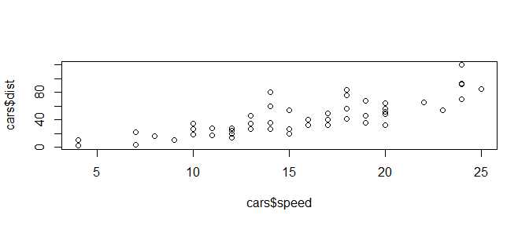
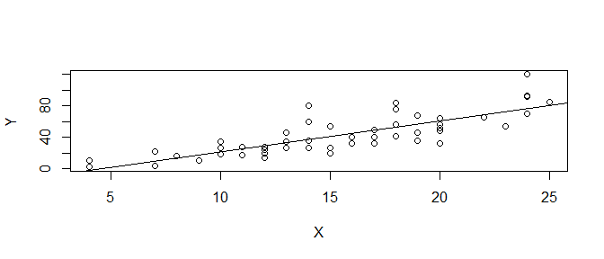

Generalized Linear Model
================
Takeshi Kishiyama
2019/06/14 16:37

**8章と9章**
============

今日のテーマ
------------

-   R入門
-   **8章と9章**
-   10章

8章と9章
--------

-   **相関関係と因果関係の違い**
    -   見た目は似てるけど...?
-   線形回帰、パラメータ推定
    -   `optim` を実際に利用（GLMのウォーミングアップ）
-   線形回帰の範囲と限界
    -   できない問題、GLMならできます。

相関関係と因果関係の違い
------------------------

線形回帰の前に、以下の２つのどちらが相関で因果？

``` r
layout(matrix(1:2, ncol=2)) 
# 木の高さ体積の関係(図左)
plot(x=trees$Height, y=trees$Volume)
# 車の時速と停止距離の関係(図右)
plot(x=cars$speed, y=cars$dist)
```


相関関係と因果関係の違い
------------------------

グラフの見た目は似ているけど、仕組みは異なる。

-   相関: X(height)とY(volume)の2変量の間の関連性
    -   Xを変えてもYは変わらない。(交絡因子の存在)
-   因果: X(speed)がY(distance)を説明
    -   Xを変えるとYも変動しそう。
    -   → **XはYを説明** し、 **YはXに応答(依存、従属)**

<!--html_preserve-->

<script type="application/json" data-for="htmlwidget-fe69f58e31df0411bd03">{"x":{"diagram":"\n\ndigraph boxes_and_circles {\n\n  # a \"graph\" statement\n  graph [overlap = true, fontsize = 8]\n\n  # several \"node\" statements\n  node [shape = box,\n        fontname = Helvetica]\n  height; volume; confounding_factors;\n  speed; distance;\n\n  # several \"edge\" statements\n  confounding_factors -> height\n  confounding_factors -> volume\n  speed -> distance\n\n}\n\n","config":{"engine":"dot","options":null}},"evals":[],"jsHooks":[]}</script>
<!--/html_preserve-->
相関関係と因果関係の違い
------------------------

相関と因果を見分ける判断基準: Hill(1965)の抜粋

-   X → Y の相関強い？(定量化)
-   X → Y は時系列に沿ってる？
-   X → Y は他の知見と比べて妥当？

``` r
# cor.test関数でピアソンの相関係数(r)とt値を求める
# 分母（ばらつき）が大きいとrは下がる。
cor.test(cars$speed, cars$dist)
```

    ## 
    ##  Pearson's product-moment correlation
    ## 
    ## data:  cars$speed and cars$dist
    ## t = 9.464, df = 48, p-value = 1.49e-12
    ## alternative hypothesis: true correlation is not equal to 0
    ## 95 percent confidence interval:
    ##  0.6816422 0.8862036
    ## sample estimates:
    ##       cor 
    ## 0.8068949

相関関係と因果関係の違いのまとめ
--------------------------------

-   見た目はそっくりさんだけど、相関はXがYを説明しない。
-   他方、因果はXがYを説明し、YはXに応答する。
-   因果は相関の強さや時系列、他の知見を考慮。

相関の定量化は分かったけど、**因果** はどう定量化するの？


線形回帰、パラメータ推定
------------------------

因果のある **XはYを説明** し、 **YはXに応答(依存、従属)**

-   因果: X(speed)がY(distance)を説明(切片と傾きでモデル化)
-   $\\hat{Y}\_i = a + b X\_i$ (aとbが0より大きいか、が問題)



線形回帰、パラメータ推定
------------------------

モデル式と実測値の誤差を最小にするようなaとbが欲しい。

-   $\\sum\_{i=1}^{n}\\varepsilon\_i^2 = \\sum\_{i=1}^{n}(Y\_i - (a + b X\_i))^2$

``` r
X <- cars$speed
Y <- cars$dist
least.square <- function(parameters){
    a <- parameters[1]
    b <- parameters[2]
    Y.hat <- a + b * X
    sum((Y-Y.hat)^2) # この値は誤差なので、小さいほどよい。
}

optim(c(0, 1), fn = least.square)$par
```

    ## [1] -17.578151   3.932216

因果関係と線形回帰、パラメータ推定
----------------------------------

``` r
# 一行でもできる。
plot(Y~X)
result <- lm(Y~X)
abline(result)
```



線形回帰、パラメータ推定
------------------------

``` r
summary(result)
```

    ## 
    ## Call:
    ## lm(formula = Y ~ X)
    ## 
    ## Residuals:
    ##     Min      1Q  Median      3Q     Max 
    ## -29.069  -9.525  -2.272   9.215  43.201 
    ## 
    ## Coefficients:
    ##             Estimate Std. Error t value Pr(>|t|)    
    ## (Intercept) -17.5791     6.7584  -2.601   0.0123 *  
    ## X             3.9324     0.4155   9.464 1.49e-12 ***
    ## ---
    ## Signif. codes:  0 '***' 0.001 '**' 0.01 '*' 0.05 '.' 0.1 ' ' 1
    ## 
    ## Residual standard error: 15.38 on 48 degrees of freedom
    ## Multiple R-squared:  0.6511, Adjusted R-squared:  0.6438 
    ## F-statistic: 89.57 on 1 and 48 DF,  p-value: 1.49e-12

線形回帰、パラメータ推定まとめ
------------------------------

-   説明変数と応答変数
-   誤差を最小にする関数を作ってパラメター推定
-   `lm` で簡単に作れる。
    -   p(パラメターの分布が0より大きい確率...?)も出せる。

解ける問題、解けない問題

線形回帰の範囲と限界
--------------------

形

-   特徴は線形
-   非線形は？

線形回帰の範囲と限界
--------------------

誤差

-   誤差の範囲は？
-   ほかの分布はどうだろう。

線形回帰の範囲と限界のまとめ
----------------------------

解ける範囲と解けない範囲

今日のテーマ
------------

-   R入門（関数型っぽく）
-   **8章と9章** ← OK？
    -   説明が足りなかった部分、教えてくださいー
-   10章
