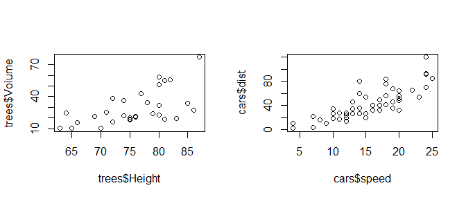
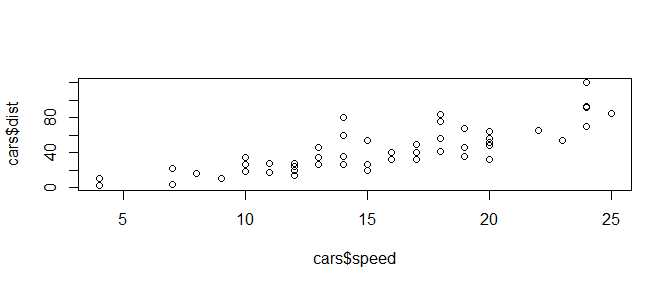

Generalized Linear Model
================
Takeshi Kishiyama
2019/06/06 21:25

**8章と9章**
============

今日のテーマ
------------

-   R入門（関数型のアプローチ）
-   **8章と9章**
-   10章

8章と9章
--------

-   **相関関係と因果関係の違い(交絡変数は触れたい)**
    -   見た目は似てるけど...?
-   線形回帰のパラメータ推定
    -   さっきの `optim` を実際に利用（GLMのウォーミングアップ）
-   線形回帰が解決できる／できない問題
    -   できない問題、GLMならできます。

相関関係と因果関係の違い
------------------------

線形回帰の前に、以下の２つのどちらが相関で因果？

``` r
layout(matrix(1:2, ncol=2)) 
# 木の高さ体積の関係(図左)
plot(x=trees$Height, y=trees$Volume)
# 車の時速と停止距離の関係(図右)
plot(x=cars$speed, y=cars$dist)
```



相関関係と因果関係の違い
------------------------

グラフの見た目は似ているけど、仕組みは異なる。

-   相関: X(height)とY(volume)の2変量の間の関連性
    -   Xを変えてもYは変わらない。(交絡因子の存在)
-   因果: X(speed)がY(distance)を説明
    -   Xを変えるとYも変動しそう。
    -   → **XはYを説明** し、 **YはXに応答(依存、従属)**

<!--html_preserve-->

<script type="application/json" data-for="htmlwidget-63307cc18e501c78599b">{"x":{"diagram":"\n\ndigraph boxes_and_circles {\n\n  # a \"graph\" statement\n  graph [overlap = true, fontsize = 8]\n\n  # several \"node\" statements\n  node [shape = box,\n        fontname = Helvetica]\n  height; volume; confounding_factors;\n  speed; distance;\n\n  # several \"edge\" statements\n  confounding_factors -> height\n  confounding_factors -> volume\n  speed -> distance\n\n}\n\n","config":{"engine":"dot","options":null}},"evals":[],"jsHooks":[]}</script>
<!--/html_preserve-->
相関関係と因果関係
------------------

相関と因果を見分ける判断基準: Hill(1965)の抜粋

-   X → Y の相関強い？(定量化)
-   X → Y は時系列に沿ってる？
-   X → Y は他の知見と比べて妥当？

相関関係と因果関係の違いのまとめ
--------------------------------

-   見た目はそっくりさんだけど、相関はXがYを説明しない。
-   他方、因果はXがYを説明し、YはXに応答する。
-   因果は相関の強さや時系列、他の知見を考慮。

相関の定量化は分かったけど、因果はどう定量化するの？

``` r
layout(matrix(1:2, ncol=2)) 
# 木の高さ体積の関係(図左)
plot(x=trees$Height, y=trees$Volume)
# 車の時速と停止距離の関係(図右)
plot(x=cars$speed, y=cars$dist)
```



因果関係と線形回帰
------------------

線を引く気持ちと統計量

-   因果: X(speed)がY(distance)を説明
    -   判断基準: Hill(1965)の抜粋
        -   A → Bの相関強い？
        -   A → Bは時系列に沿ってる？
        -   A → Bは他の知見と比べて妥当？
    -   $\\hat{Y}\_i = a + b X\_i$

線形回帰のパラメータ推定
------------------------

線形回帰が解決できる／できない問題
----------------------------------
