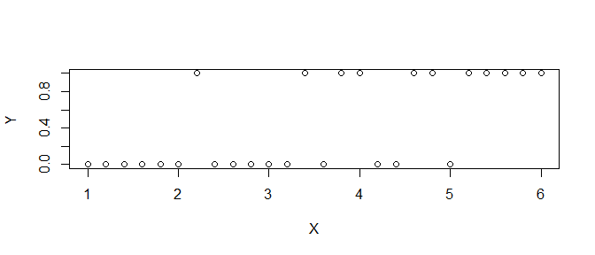
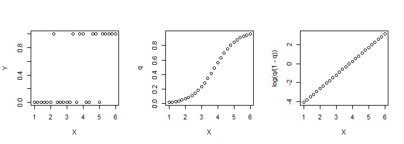

Generalized Linear Model
================
Takeshi Kishiyama
2019/06/16 17:08

はじめに
========

今日のテーマ
------------

-   R入門
-   8章と9章
-   **10章**

``` r
# 余白があるのでシードを与える
# 乱数なんかを固定できる
set.seed(1)
```

10章
----

-   一般化線形モデルが解決できる問題
-   一般化線形モデルのパラメータ推定
-   パラメータ推定の細かい話

一般化線形モデルが解決できる問題
--------------------------------

さっきのグラフ、実はこんな感じで作っていました。(p.149をもとに)

``` r
# X -> z(線形予測子) -> logistic関数 -> binom -> Y
X = seq(1, 6, 0.2)  # 1から6まで0.2刻み
z = -5.56 + (1.45 * X)  # まだ線形
q = 1/(1+exp(-z))  # ロジスティック関数。非線形に変換。まだYではない。
Y = sapply(q, function(q){rbinom(1, 1, q)})  # q で起きる事象を1回観測
plot(X, Y) # 殺虫剤の濃度(X)に対して個体が死んだ(1)か生きた(0)か -> Y
```



一般化線形モデルが解決できる問題
--------------------------------

虫の生き死に以外にも、こういう問題設定はいろいろとある

-   条件によって容認度(2値)が変わるかどうか
    -   読み時間と違って数値が離散的
-   教育法によってスコアが上がるかどうか
    -   床と天井が存在する

``` r
dose.data <- data.frame(dose=X, is.dead=Y)
head(dose.data, 3)
```

    ##   dose is.dead
    ## 1  1.0       0
    ## 2  1.2       0
    ## 3  1.4       0

一般化線形モデルが解決できる問題
--------------------------------

この図のような「直線で解決しない問題」

-   線形モデルを一般化して広範囲の問題に対処可能
-   非線形と線形を行き来できる関数が必要(リンク関数)

``` r
plot(X, Y)
```


一般化線形モデルのパラメータ推定
--------------------------------

1.  不連続なデータY(確率分布から生成されている)
2.  Yを生成した確率分布のパラメターq (qは推定対象)
    -   p.141の「実際にはYが従う確率分布のパラメター」 *y* → *q*
3.  qをリンク関数に食べさせて線形予測子にする (*β* は推定対象)
    -   *f*(*q*)=*z*<sub>*i*</sub> = *β*<sub>0</sub> + *β*<sub>1</sub>*x*<sub>*i*1</sub> + *β*<sub>2</sub>*x*<sub>*i*2</sub> + ...*β*<sub>*k*</sub>*x*<sub>*i**k*</sub> + *ϵ*

``` r
layout(matrix(1:3, ncol=3)) 
plot(X, Y)  # まだ0--1の値。不連続
plot(X, q)  # 0--1を生み出した確率分布のパラメターqを想定。連続だけど非線形
plot(X, log(q/(1-q)))  # リンク関数がqを食べて線形になる
```



一般化線形モデルのパラメータ推定
--------------------------------

-   「パラメターqの確率分布」ってzに従っていて、 でもそのzの中に *β* がいて、具体的な数値はわからない...
    -   *β*<sub>0</sub> と *β*<sub>1</sub> でqの線が変わり、尤度も変わる
    -   → 最尤推定

``` r
# X -> z(線形予測子) -> logistic関数 -> binom -> Y
X = seq(1, 6, 0.2)  # 1から6まで0.2刻み
b_0 <- 0 # 試しにb_0 に 0 を
b_1 <- 1 # b_1 に 1 を入れてみる
z = b_0 + (b_1 * X)  # まだ線形
q = 1/(1+exp(-z))  # ロジスティック関数。非線形に変換。まだYではない。
Y.p = dbinom(Y, 1, q)  # q から Yが産出される確率
sum(log(Y.p))  # の対数尤度。これを最大化したい。
```

    ## [1] -42.04316

一般化線形モデルのパラメータ推定
--------------------------------

-   データYに対する尤度を最大にする *β* を推定

``` r
# X -> z(線形予測子) -> logistic関数 -> binom -> Y
LL <- function(parameters){
    X = seq(1, 6, 0.2)  # 1から6まで0.2刻み
    b_0 <- parameters[1]
    b_1 <- parameters[2]
    z = b_0 + (b_1 * X)  # まだ線形
    q = 1/(1+exp(-z))  # ロジスティック関数。非線形に変換。まだYではない。
    Y.p = dbinom(Y, 1, q)
    -sum(log(Y.p))
}
optim(c(1,1), LL)$par
```

    ## [1] -4.882872  1.240992

一般化線形モデルのパラメータ推定
--------------------------------

``` r
# 線形回帰の時と同じく、一行で実行可能
result <- glm(Y~X, family=binomial(logit))
summary(result)
```

    ## 
    ## Call:
    ## glm(formula = Y ~ X, family = binomial(logit))
    ## 
    ## Deviance Residuals: 
    ##     Min       1Q   Median       3Q      Max  
    ## -1.7656  -0.6439  -0.2736   0.5980   2.1273  
    ## 
    ## Coefficients:
    ##             Estimate Std. Error z value Pr(>|z|)   
    ## (Intercept)  -4.8834     1.8436  -2.649  0.00808 **
    ## X             1.2412     0.4628   2.682  0.00732 **
    ## ---
    ## Signif. codes:  0 '***' 0.001 '**' 0.01 '*' 0.05 '.' 0.1 ' ' 1
    ## 
    ## (Dispersion parameter for binomial family taken to be 1)
    ## 
    ##     Null deviance: 35.426  on 25  degrees of freedom
    ## Residual deviance: 22.943  on 24  degrees of freedom
    ## AIC: 26.943
    ## 
    ## Number of Fisher Scoring iterations: 5

パラメータ推定の細かい話
------------------------

-   p値はどこから？
    -   最尤法の一つ、MCMC でパラメターの確率分布をサンプリングして求めます。
-   その他の例
    -   確率分布とリンク関数の組み合わせで色々な分布をモデリングできます。p.146
-   AIC
    -   尤度の高さと変数の数のトレードオフ、という話です。
-   オフセット
    -   生存率A/Bのような値、分母の情報が削られます。下駄をはかせて対処しましょう。

GLM
---

一般化線形モデル、GLM(Generalized Linear Model)とは？ <br> (教科書のp.141)

-   説明変数 (*x*<sub>*i*1</sub>, *x*<sub>*i*2</sub>, ..., *x*<sub>*i**k*</sub>) と 切片 *β*<sub>0</sub> 、傾き (*β*<sub>1</sub>, *β*<sub>2</sub>, ...*β*<sub>*k*</sub>) で 応答変数 *y*<sub>*i*</sub> をモデルする。
-   *f*(*y*<sub>*i*</sub>)=*z*<sub>*i*</sub> = *β*<sub>0</sub> + *β*<sub>1</sub>*x*<sub>*i*1</sub> + *β*<sub>2</sub>*x*<sub>*i*2</sub> + ...*β*<sub>*k*</sub>*x*<sub>*i**k*</sub> + *ϵ*
-   左辺はリンク関数 *f*(*y*<sub>*i*</sub>) で 右辺の *z*<sub>*i*</sub> を線形予測子と呼ぶ。
-   なお、*f*(*y*) の *y* は応答変数 *y* が従う確率分布のパラメターとする。

なるほど！

参考文献
--------

そもそも数学覚えてない人向け

-   映像授業 Try IT（トライイット） <sub>\#2倍速がおすすめ。条件付き確率は必須</sub>
-   マンガ「解析学」超入門 <sub>\#関数、微積分と仲良くなれる。TryITを一通り見た後がおすすめ</sub>
-   ヨビノリ/Aicia Solid Project あたりのベイズ/統計回 <sub>\#人を選ぶが分かりやすい。</sub>

数式と仲良くなり始めた人向け

-   Rで学ぶ統計学入門
-   データ解析のための統計モデリング入門
-   プログラミングのための確率統計/線形代数

さらに向こうへ!

-   StanとRでベイズ統計モデリング
-   岩波データサイエンス、ベイズモデリングの世界
-   パターン認識と機械学習
